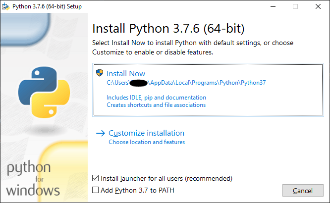

# Environment Setup

Getting setup to develop for the CSX website backend is relatively simple. There are just a few
basic requirements.

- [Python 3.6+](#python)
- [Git](#git)
- [An IDE/Editor to write code in](#the-editor)
- [Postgres](#postgres)
  - This can be locally hosted, or can be on Google Cloud SQL. We will include documentation for both.

## Python

The CSX website backend is a Django project, which means it is written almost exclusively in Python. So
in order to be able to contribute to the project you will need to make sure you have Python 3.6 or greater
installed.

### Installing Python

#### Windows

To install python on windows you will want to download the installer for any compatible version (anything >3.6)
from [the python website](https://python.org). (Or, if you are using Windows 10, you can install it from the Windows
store, just search for Python)

When you run the installer you should see a window like this:



```eval_rst
.. note::
    Keep `Install launcher for all users (recommended)` selected. This will make managing your python versions much easier should you ever need to install other versions.
```

Just hit `Install Now` and keep any recommended
settings on subsequent screens.

Congratulations! Python is now installed on your machine!

To verify the installation, open up a command prompt window and run the command `py` or `py -3`.

#### Linux

There are many different linux distributions, and many of them handle packages differently. The most
popular distribution of linux is by far Ubuntu, so these we will focus on that.

If you are running Ubuntu 18.xx or 19.xx, put your feet up, and relax! You already have a compatible version of
python installed. To verify this, open up a terminal window and run the `python3` command.
If you are running 19.xx you should see `Python 3.7.x` and if you are running 18.xx you should see `Python 3.6.x` (Release versions may vary slightly depending on exact Ubuntu version)

If you are on any version before 18.04, you will need to check to make sure that the package `python3.7` is available for your
version of Ubuntu. To do this run the following command

```
$ apt search ^python3.[0-9]$
```

This command will search the package repositories and return all the python version packages that are available for you to install.
If to install one of the available packages just run `sudo apt-get install` followed by the package name. You can then verify the installation
by running `python3.x` where `x` represents the compatible minor version that you installed.

```eval_rst
.. note::
   Ubuntu 17.10 may have a compatible version of python3 installed by default.
```

#### macOS

MacOS comes with Python 2 installed, however to avoid any compatability concerns we require a Python version greater than 3.6. You can find a free download for any Python version from [the python website](https://python.org).

Double click on your downloaded .pkg file to run the installer and follow the instructions. There is no need to customize the installation.

Congratulations! Python is now installed on your machine!

To verify the installation, open up a command prompt window and run the command `python3`.

```eval_rst
.. note::
   On macOS, `python` will run Python 2. To use the correct version of Python for the project you must specify `python3`.
```

### Setting Up a Python Virtual Environment

```eval_rst
.. admonition:: What is a Virtual Environment?

    A virtual environment is an isolated working copy of python, which allows you to work on a specific project without affecting other projects that you might be working on.
```

Before we create a virtual environment, it is a good idea to create a folder in which to put our virtual
environment folders. This can be anywhere you like, and called what ever you like. Just make sure you know
what it is called, and that it is in a convenient place for you to access.

Now that we have a folder to hold out virtual environments, lets create one!

1. First, open a terminal window (or Command Prompt for those on Windows), and navigate to the folder
   that you made to hold your virtual environments.
2. Run the following command `python -m venv NAME` where `NAME` is the name of your virtual environment.
3. To check that the virtual environment was created, you can check to see if there is a folder that now matches
   what you called the virtual environment you created.

```eval_rst
.. warning::
    * `python` is used to be generic, on windows you may have to use `py` or `py -3` in order to run python commands from the command line. Linux and mac users may need to use `python3`
    * In somecases `venv` does not work, you can instead try replacing it with `virtualenv`
    * Linux users may need to install `python3-venv` (or `python3.x-venv` if you had to install your python version after the fact)
```

### Using a Python Virtual Environment

To use a venv (virtual environment) you must first activate. When you activate a venv you are telling
your terminal to use it for anything python related, rather than your system-wide installation.

Like many things, activating your venv is slightly different on Windows than it is on Linux or macOS. Luckily, once
activated, all the commands are the same going forward.

- Windows: Navigate to `PATH\TO\VENV\Scripts\` and run `activate.bat`
- Linux/macOS: Run the command `source /path/to/venv/lib/activate`

You will know you that the venv is active when you see `(NAME)` (where `NAME` is the name fo your venv) at the beginning
of every prompt.

While the venv is active, you can run python using the `python` command, regardless of OS or python version.

To deactivate the venv, simply run the command `deactivate`.

```eval_rst
.. note::
    ALL other project documentation will assume you are running with your venv active.
```

## Git

This project is developed using Git for version control. Git allows multiple people to work on the same
project without getting in each other's way, and makes tracking and reversing changes simple.

### Installing Git

#### Windows

The Git windows installer can be found at [git-scm.com](https://git-scm.com). The installation is very simple,
just keep all the default settings in the installer, and you'll be good to go.

Once git is installed, you will want to run the following commands either in Git Bash or in Command Prompt
to set some global git settings.

```
$ git config --global user.name "FIRST_NAME LAST_NAME"
$ git config --global user.email "MY_NAME@example.com"
```

#### Linux

Installing git on Ubuntu is a very simple process. All you need to do is open up a terminal window
and run the following commands:

```bash
$ sudo apt-get install git
```

Once installed you will want to run the some commands to set global git settings.

```bash
$ git config --global user.name "Your Name"
$ git config --global user.email "youremail@yourdomain.com"
```

#### macOS

Depending on your version of macOS, you might already have git installed. To check, open a terminal
window and run the following command:

```bash
$ git --version
```

If you get a see `git version x.xx.xx` come up, that means that it is already installed. If not, you will
have to install it yourself.

Just like on windows you can find the Git Installer for mac at [git-scm.com](https://git-scm.com). Just download and run the
installer.

Once installed (or after you have verified that it came preinstalled) you will want to run the following commands
to set some global settings.

```bash
$ git config --global user.name "Your Name"
$ git config --global user.email "youremail@yourdomain.com"
```

### Using Git

Git is a command line tool for managing git repositories. However, just because it is a command line
tool does not mean that you have to use it in the command line. There are many GUI Git clients out there
that make working with git very user friendly.

You can find a list of Git GUI clients on the [GUI Clients page at git-scm.com](https://git-scm.com/downloads/guis).

For more information about using git, checkout our [Git Help Documentation](git_help.md).

## The Editor

The two most common editors you will likely come across for python are VSCode and PyCharm, though you can
use anything you want to write python code.

### VSCode

VSCode, or Visual Studio Code is an open source, cross platform text editor developed and maintained by Microsoft. Popular among web
developers, VSCode has a similar look and feel to Microsoft's Visual Studio line of IDEs which are commonly used for C++ and C# development.

Though the editor itself is fairly bare bones, it has an extensive extension library to add all sorts of functionality as well
as modify the look and feel of the application. 

For the purposes of this project there are no extensions that you _need_ other than the python extension authored by Microsoft. 

#### Configuring VSCode
_Coming Soon_

### PyCharm

PyCharm is a Python IDE made by the same people that make the popular Java IDE IntelliJ. In fact,
PyCharm runs on the same code base as IntelliJ, meaning if you are familiar with the layout and
workings of IntelliJ, you will be right at home with PyCharm.

There are two versions of PyCharm available. Community and Pro.

The Community edition is free while the Pro version is a paid product.

```eval_rst
+------------------------------------------+-------------+-------+
| Feature                                  | Community   | Pro   |
+==========================================+=============+=======+
| IntelliJ Based Editor                    | Y           | Y     |
+------------------------------------------+-------------+-------+
| Built in Debugger and Test runner        | Y           | Y     |
+------------------------------------------+-------------+-------+
| Intelligent Refactoring and Navigation   | Y           | Y     |
+------------------------------------------+-------------+-------+
| Code Inspection                          | Y           | Y     |
+------------------------------------------+-------------+-------+
| VCS (Git) Support                        | Y           | Y     |
+------------------------------------------+-------------+-------+
| Scientific Tools                         | N           | Y     |
+------------------------------------------+-------------+-------+
| Web Dev (WebStorm Features Bundled)      | N           | Y     |
+------------------------------------------+-------------+-------+
| Python Web Frameworks                    | N           | Y     |
+------------------------------------------+-------------+-------+
| Python Performance Profiler              | N           | Y     |
+------------------------------------------+-------------+-------+
| Remote Development                       | N           | Y     |
+------------------------------------------+-------------+-------+
| Database & SQL Support                   | N           | Y     |
+------------------------------------------+-------------+-------+
```

Though PyCharm Pro is a paid product, you can apply for a Student license for free [here](https://www.jetbrains.com/student/).
If you plan to use PyCharm it is a good idea to get the free license to have access to the extra features that Pro provides, however
the community version would work just fine.

#### PyCharm Project Settings

Once you have setup pycharm, and opened the project, there are some settings that you will want to configure.

##### Project Interpreter

First, you will want to set the project interpreter. This is what pycharm will use to give you hints when you use
libraries. To open the settings window, you can go to `File > Settings` or hit `Ctrl`+`Alt`+`S`. Then find `Project: <project-name>`
in the sidebar, and expand it to find the `Project Interpreter` settings. To add an interpreter, click the cog () and select `Add New`.

In the window that appears, check the radio button next to `Existing Environment` and then click on the "..." button () and then navigate to your
venv folder, and find the python executable. Select the python executable, and click the `OK` button. Hit OK on the new interpreter window, and then select the
interpreter that you just added from the dropdown.

```eval_rst
.. note::
    * On Windows you will be looking for either `python.exe` or `pythonw.exe`, both will work.
        * On Windows this will be located in the `Scripts` folder of your venv.
    * On Linux and macOS the executable file will just be called `python`
        * On Linux and macOS this will be located in the `lib` folder of your venv.
```

##### Django Support

Back in the settings window, you should find `Languages and Frameworks` in the sidebar. When you expand this
category, you one of the sub-categories will be `Django`. Select Django and tick the `Enable Django Support` box.

Now click the little folder icon in the text box next to `Django Project Root`, and navigate to the folder in the project folder
containing `manage.py`, and hit ok.

##### Run/Debug Configurations

PyCharm comes with a debugger that you can use to run your applications with, but it needs to be configured.

At the top right of the IDE window you will see a button that says `Add Configuration`. Click this button and you should have a window pop up titled `Run/Debug Configurations`.
At the top left of the window you should see a plus (+) sign. Click on the plus sign and select the `Django Server` option from the dropdown.

You should not need to change any of the settings, except for the interpreter as it may or may not be automatically set to the project interpreter. If it is not set to the project interpreter
just select the project interpreter from the dropdown.

By default it will start the server on port 8000, you should not need to change this unless you already have something running on that port.

## Postgres

### Installing Postgres

#### Windows

Installing postgresql on Windows is pretty simple.

Install instructions and a link to the installer download can be found at the [postgres website](https://www.postgresql.org/download/windows/).

Simply download and run the installer for the desired version of postgresql to install it.

```eval_rst
.. note::
    The windows version of postgres comes with the option to install pgAdmin alongside postgres
    which provides a simple web-ui for managing your postgresql installation.
```


```eval_rst
.. note::
    In order to make use of the psql command in command prompy on windows you will 
    want to add `C:\\Program Files\\PostgreSQL\\XX\\bin\\psql.exe` to your PATH.

    Instructions for adding to your PATH on your version of windows can be found `here <https://www.java.com/en/download/help/path.xml>`_.
``` 

#### Linux
Like other sections of this documentation, we will assume that you are using Ubuntu.

Depending on the version of Ubuntu that you are running, the versions listed, and some commands may be slightly different.

To install postgres on Ubuntu, you will need to install two packages from apt, `postgresql` and `postgresql-contrib`.

```bash
$ sudo apt-get install postgresql postgresql-contrib
```

##### Configuring Postgres
The postgres service may not start automatically, to check if it is running run the folloqing command:

```bash
$ sudo service postgresql status
```

If is is not running you should see `10/main (port 5432): down`, to turn it on run the following command:

```bash
$ sudo service postgresql start
```

Postgres should now be running.

#### macOS
_Coming Soon_


### Creating a User and Database
It is generally understood that running applications with root permissions is a bad idea. This 
extends to database access too. So to avoid using the postgres equivalent of a root user (which is just postgres... so original)
we will create a new user, and the database that we are going to use.


#### Accessing the Postgres CLI
##### Windows
Assuming that you have added `psql.exe` to your path, the following command should be all you need to access the postgres CLI:

```
$ psql -U postgres -W
```

You will be prompted to enter the password that you set when you ran the installer. If you set no password, you can leave off the `-W`.

##### Linux
To access postgres from the command line you will have to sudo the postgres user, as postgres by default
uses system authentication. There are two ways to do this.

The first option is to use `sudo su` to switch your user to the postgres user. Then after switching
to the postgres user, you can run the `psql` command to enter the postgres cli.

```bash
$ sudo su postgres
$ psql
```

The second option is to just use sudo to run the psql command as the postgres user.

```bash
$ sudo -u postgres psql
```

You will know you are in the postgres CLI rather than bash when you see the following:

```bash
psql (10.9 (Ubuntu 10.9-0ubuntu0.18.04.1))
Type "help" for help.

dbname=#
```

Where dbname is the database that you are currently connected to. Which for the case of the above 
commands will be `postgres`.

##### macOS
_Coming Soon_

#### Creating a User
Once you are connected connected to the database CLI, SQL commands are pretty standard. Though if you are 
used to MySQL or some other SQL server, there are some slight differences.

The following is the command to create a new user.

```sql
CREATE USER user_name WITH PASSWORD 'password';
```

Where `user_name` is the user name you wish to give to the user, and `'password'` is the password that you
would like to give the user (_Thus must be kept inside single quotes!_).

#### Creating a Database
The following is the command to create a new database.

```sql
CREATE DATABASE db_name;
```

Now, you have to give the user the ability to work on the database. To do this use the following
command.

```sql
GRANT ALL PRIVILEGES ON DATABASE db_name TO user_name;
```

Once you have created your database and user, as well as assigned permissions to the 
user on the database, you can exit the postgres CLI by entering the `\q` command.